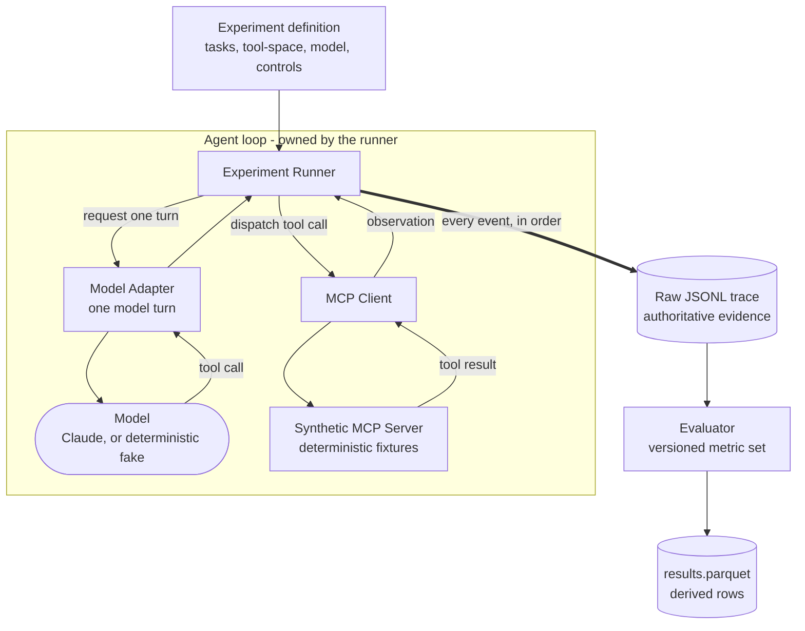
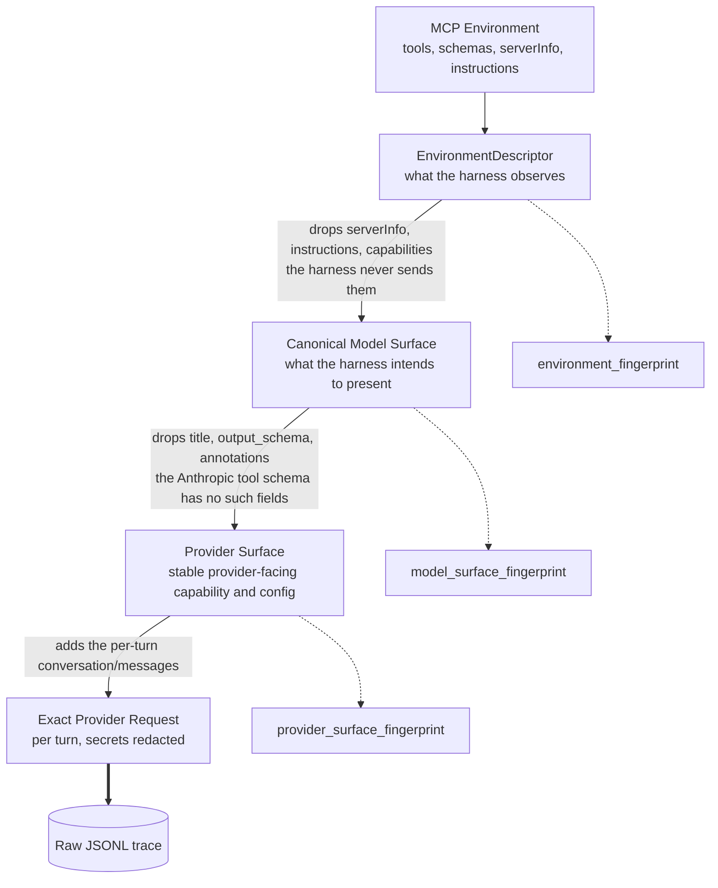

# Agent Systems Lab

An experimental instrument for studying **evolving LLM agent systems** - what happens to a
persistent agent when its capabilities, environment, and learned experience change over time.

**This is a research laboratory, not an agent framework and not a product.** Its output is
evidence: controlled, reproducible, inspectable observations about agent behaviour. Platform work
exists only to make valid experiments easier to run, inspect, reproduce, and extend.

- `SPEC.md` - authoritative research and build specification.
- `AGENTS.md` - operating rules for any coding/research agent working here.
- `CLAUDE.md` - Claude Code-specific workflow guidance.

## Why it exists

To find poorly understood behaviour in modern LLM agent systems, turn it into controlled
experiments, and publish results that are useful to the wider AI community. Success is one
trustworthy, non-obvious, reproducible observation - not a large feature set.

## How it works

The lab is an experiment runner wrapped around a model interacting with a controlled MCP
environment. The runner owns the agent loop; the adapter represents a single model turn.
Everything observable is written to a raw trace, and results are derived from that trace rather
than recorded alongside it.



The loop repeats until the model answers without calling a tool, or a step limit is reached. The
evaluator reads only the trace, so every derived row can be recomputed from the evidence.

## Current status

**Milestone 4 complete: Phase 0 calibration succeeded.** The lab detected a routing change when
five semantically overlapping customer tools were added to a stable five-tool surface, on a
frozen pre-registered 28-task design executed against `claude-opus-5`.

Phase 0 is a **positive control on the instrument, not a research contribution** - it reproduces
a known effect to show the apparatus can measure one. The result is not novel and is not
presented as a finding about agent systems. See
[`research/preregistration/PHASE0.md`](research/preregistration/PHASE0.md) for the frozen design
and `research/experiment-log.md` for the outcome.

| Milestone | State |
|---|---|
| M0 - repository foundation | ✅ complete |
| M1 - deterministic synthetic MCP environment | ✅ complete |
| M2 - core experiment harness | ✅ complete |
| M3 - first real provider adapter | ✅ complete |
| M4 - Phase 0 calibration experiment | ✅ complete |
| M5 - analysis ergonomics (DuckDB) | not started |
| Research Gate 1 - select first frontier question | blocked on M0-M5 |

**Active research question:** none. Phase 0 is *calibration only* - a positive control proving
the instrument can detect a known effect. It is explicitly not the intended contribution.

**Mandatory stop in force** (`SPEC.md` s16). After Phase 0 the lab does **not** proceed to a
matrix of tool-count, naming, description, schema, ordering, or multi-model experiments. The
novelty gate (`SPEC.md` s3) must be invoked and a frontier question explicitly selected before any
further research programme is implemented.

## Installation

Requires [`uv`](https://docs.astral.sh/uv/). Python 3.12+ is fetched by `uv` if needed.

```bash
uv sync
```

No provider credentials are required to install or to run the test suite.

## Development

```bash
uv run pytest
```

```bash
uv run ruff check . && uv run ruff format --check .
```

```bash
uv run pyright
```

Pyright requires a Node runtime; it uses the system `node` if present and otherwise downloads one
on first run, so it is the one development command that is not offline-safe on a fresh clone.

Default `pytest` never makes a paid model-provider API call. Provider-hitting tests are marked
`paid` and are deselected unless explicitly requested with `-m paid`.

## Running experiments

Experiments are declarative. Validate one without executing it:

```bash
uv run agent-lab validate experiments/harness_check/experiment.yaml
```

Execute it:

```bash
uv run agent-lab run experiments/harness_check/experiment.yaml
```

`harness_check` is an instrument self-check driven by a deterministic **scripted** adapter. It
makes no external API calls and produces no evidence about agent behaviour.

Cost-incurring providers require explicit per-invocation authorization. Having
`ANTHROPIC_API_KEY` configured authorizes nothing:

```bash
uv run agent-lab run experiments/smoke_anthropic/experiment.yaml --allow-paid
```

Without `--allow-paid` the command prints the model, controls, planned runs, and request budget,
then refuses. A hard `cost_controls.max_provider_requests` ceiling is enforced before every
provider request - it bounds the number of provider calls, **not** spend, since token volume per
request varies and `max_tokens` permits much larger responses than a typical one.

Delete disposable harness-check output (and nothing else):

```bash
uv run agent-lab clean harness-check
```

`summarize`, `compare`, and `inspect` arrive with Milestone 5.

## The synthetic environment

A deterministic, fixture-backed MCP server is the controlled apparatus for the Phase 0
calibration. It exposes two named tool-spaces, selected server-side at launch, so the real
`tools/list` surface differs between conditions:

| Tool-space | Tools |
|---|---|
| `customer_baseline_v1` | `get_customer`, `get_order`, `get_invoice`, `get_product`, `get_employee` |
| `customer_overlap_v1` | those five, plus `find_customer`, `search_customers`, `get_customer_details`, `lookup_customer`, `customer_information` |

```bash
uv run python -m agent_lab.synthetic.server --tool-space customer_overlap_v1
```

See [`src/agent_lab/synthetic/README.md`](src/agent_lab/synthetic/README.md) for the fixture
design, determinism guarantees, and the documented intent behind the overlapping tools.

### What the model actually sees

The environment the harness observes, the surface it intends to present, and the payload a
provider actually receives are **three different objects**, and the lab does not assume they are
semantically equivalent. Each transformation drops something.



The three fingerprints are **comparison aids**: they answer "did this surface change between
conditions or runs?". The exact provider request is **evidence**: it is preserved verbatim for
every turn, and carries its own per-turn hash. Confusing the two would be a methodological error,
so they are deliberately named and stored apart.

## Results and traces

Each execution writes a self-contained directory under `results/` (gitignored - experiment output
is a reproducible artifact, not source):

```text
results/<experiment_id>/<execution_id>/
  manifest.json                    versions, git SHA + dirty flag, lockfile hash, fingerprints
  resolved_config.json             the fully resolved config and the frozen task set
  environments/<tool_space>.json   environment descriptor, model surface, and provider surface,
                                   each with its own fingerprint
  traces/<run_id>.jsonl            complete ordered raw trace, one file per run
  results.parquet                  normalized rows, derived from those traces
```

**The raw trace is authoritative.** Normalized rows are derived from it and are reproducible from
it; a test re-derives every row from the persisted JSONL and requires equality. Summaries rank
below both.

A logical `run_id` (`<experiment>/<condition>/<task>/r<n>`) is stable across executions, while a
physical `execution_id` keeps reruns from overwriting evidence.

Results are queryable directly with DuckDB, no application code required:

```bash
duckdb -c "SELECT tool_space_id, avg(first_call_routing_correct::INT) FROM 'results/**/results.parquet' GROUP BY 1"
```

## Defining tasks and environments

Tasks and experiments are declarative YAML under `experiments/<name>/`; tool-spaces are declared
in `agent_lab.synthetic.toolspaces`. A new experiment normally adds data, not harness code.

Each task declares its own deterministic answer-evaluation strategy (`exact_match`,
`contains_facts`, or `typed_scalar`) - there is deliberately no permissive generic matcher. The
strategy and its expected facts are frozen experimental material.

Metric semantics live in versioned definition sets (`agent_lab.evals.metrics`). To change a
metric, add a new set with a new id; never edit one in place, since that would silently
reinterpret results already on disk.

## Research gates

Work here is classified as **calibration** (reproduce a known effect to validate the instrument),
**characterisation** (isolate a mechanism), or **frontier research** (the actual purpose).

Any research programme beyond calibration must first pass the novelty gate in `SPEC.md` s3, with
its review recorded under `research/novelty/`. A direction appearing in `SPEC.md` is not evidence
that it is novel, and is not authorisation to implement it.

The research notebook - `research/hypotheses.md`, `research/observations.md`,
`research/experiment-log.md`, `research/research-backlog.md`, `research/novelty/` - is a
first-class research artifact, not documentation overhead.

## License

Apache-2.0. See `LICENSE`.
